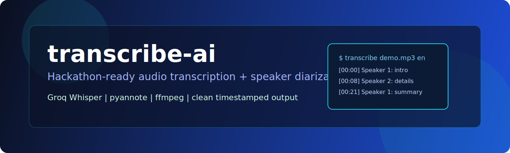
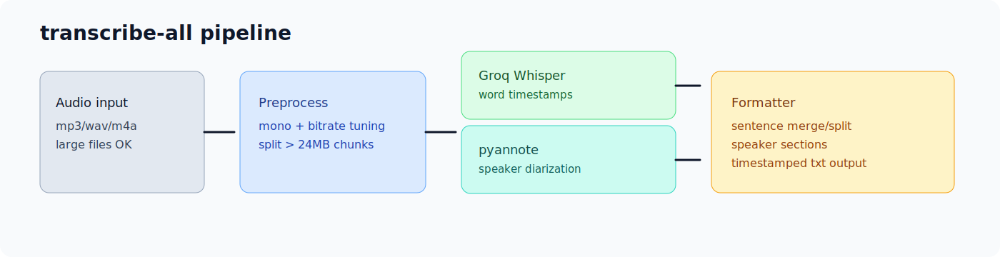

# transcribe-ai

<p align="center">
  
</p>

<p align="center">
  
  
  
  
</p>

Cloud-first transcription CLI with optional speaker diarization.
Built for fast hackathon delivery: simple install, practical output, and clear timestamps.

## Why this project

- Fast transcription via Groq Whisper models
- Speaker segmentation via pyannote (optional)
- Clean sentence blocks with timestamp formatting
- Handles large files by splitting and merging automatically
- Works from terminal with one command

<p align="center">
  
</p>

## Quick start

```bash
git clone https://github.com/your-org/transcribe-ai.git
cd transcribe-ai
chmod +x install.sh transcribe
./install.sh
```

Transcribe:

```bash
transcribe recording.mp3 en
```

## Usage

```bash
# basic
transcribe input.mp3 en

# expected speaker count
transcribe interview.mp3 en --speakers 2

# disable diarization
transcribe lecture.mp3 en --no-diarize

# local whisper.cpp mode
transcribe input.mp3 en --local
```

## Configuration

The tool reads tokens from environment variables and from:

```text
~/.config/transcribe/config
```

Required:

- `GROQ_API_KEY`

Optional:

- `HF_TOKEN` for pyannote speaker diarization
- `WHISPER_MODEL_PATH` for `--local` mode (path to `ggml-large-v3.bin`)

Use `.env.example` as reference.

## Example output

```text
-- Speaker 1 ----------------------------------------
[00:00]  Welcome to the demo recording.
[00:04]  Today we will test HTTP interception in Burp.

-- Speaker 2 ----------------------------------------
[01:32]  Open the Proxy tab and enable intercept.
[01:38]  Now inspect headers and session cookies.
```

## Project layout

```text
.
|- transcribe              # CLI entrypoint
|- transcribe_groq.py      # Core transcription + diarization pipeline
|- install.sh              # Installer for dependencies and shell setup
|- .env.example            # Environment variable template
|- CHANGELOG.md
|- RELEASE_CHECKLIST.md
`- assets/
   |- hero-banner.svg
   `- pipeline-diagram.svg
```

## Release notes

Initial release artifacts are prepared:

- `.gitignore` for Python, secrets, generated transcripts, and media
- `LICENSE` (MIT)
- `CHANGELOG.md`
- `RELEASE_CHECKLIST.md`

## License

MIT. See [LICENSE](LICENSE).
